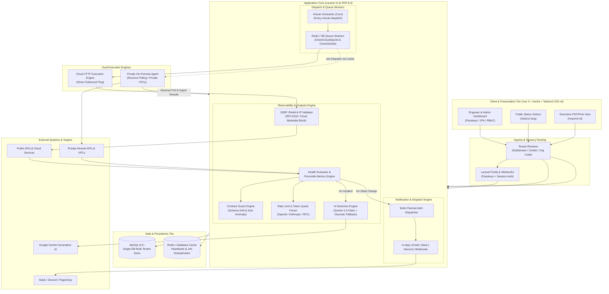
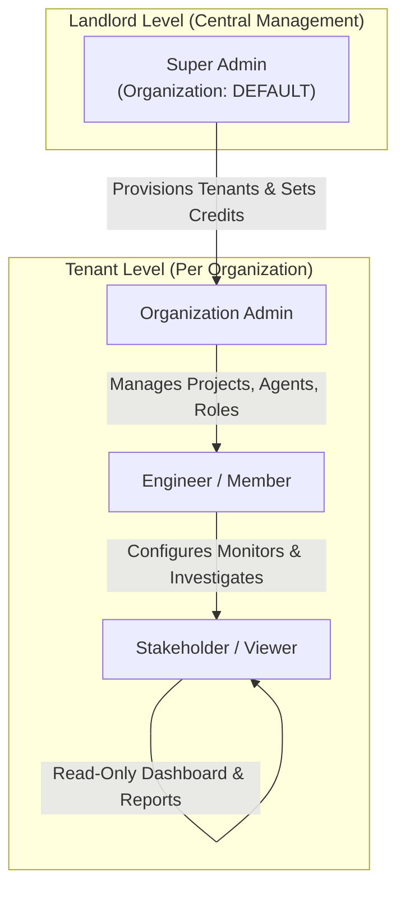
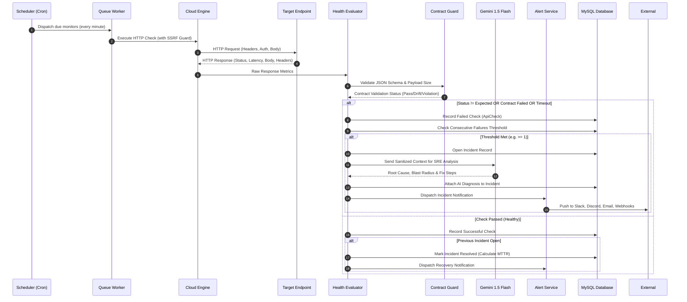
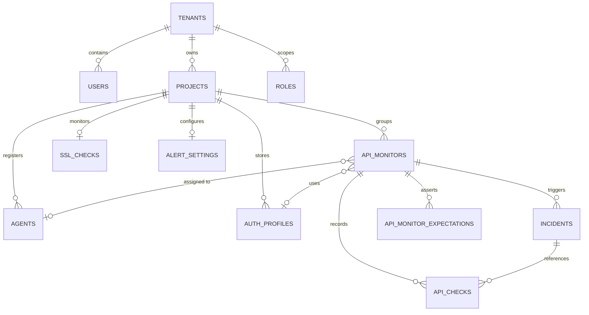

# ApiMonitor 🛰️ — Enterprise API Observability & SRE Incident Platform

> **Repository Notice & Disclaimer**  
> The production source code is private due to confidentiality and client ownership. This repository is intended only to demonstrate the system architecture, features, workflows, and technical implementation approach as a software engineering portfolio project.

---

## 📌 Table of Contents

- [Overview](#-overview)
- [Problem Statement](#-problem-statement)
- [Key Features](#-key-features)
- [System Architecture](#-system-architecture)
- [Major Modules](#-major-modules)
- [User Roles & Permissions](#-user-roles--permissions)
- [Technology Stack](#-technology-stack)
- [End-to-End System Workflow](#-end-to-end-system-workflow)
- [API & Integration Architecture](#-api--integration-architecture)
- [Database & Data Architecture](#-database--data-architecture)
- [Security & Access Control](#-security--access-control)
- [My Technical Contributions](#-my-technical-contributions)
- [Key Engineering Challenges & Solutions](#-key-engineering-challenges--solutions)
- [Screenshots & UI Showcase](#-screenshots--ui-showcase)
- [Deployment & Operational Architecture](#-deployment--operational-architecture)
- [Documentation Directory](#-documentation-directory)

---

## 🔍 Overview

**ApiMonitor** is an enterprise-grade, multi-tenant API Observability, Uptime Monitoring, Performance Analytics, and Automated Incident Response platform. Designed to bridge the gap between simple ping-checkers and heavyweight enterprise APM suites (like Datadog or New Relic), it provides developer-first visibility into external and internal API ecosystems.

The platform combines **dual polling engines**—a high-throughput cloud worker cluster with built-in SSRF protection and a zero-dependency on-premise private agent daemon—with **AI-powered incident root-cause diagnostics (Google Gemini 1.5 Flash)**, automated JSON schema contract validation, rate-limit quota consumption tracking, SSL certificate lifecycle auditing, and composite SLA reliability scoring.

---

## 🎯 Problem Statement

Modern software architectures rely heavily on microservices, third-party SaaS APIs, and Large Language Model (LLM) providers (OpenAI, Anthropic, Google). However, engineering teams face critical operational blind spots:

1. **Silent Contract Breakages**: Upstream APIs often return HTTP `200 OK` while subtly modifying the JSON schema (missing fields, unexpected `null`s, type mutations), crashing client applications without raising standard HTTP error alerts.
2. **Hidden VPC & Intranet Endpoints**: Traditional cloud uptime checkers cannot reach microservices, staging environments, or internal databases hosted behind corporate firewalls and private VPCs without exposing firewall pinholes.
3. **LLM Quota & Rate Limit Depletion**: Critical AI workloads fail unpredictably when upstream rate limits (`requests-per-minute` or `tokens-per-minute`) are exhausted without real-time quota visibility.
4. **Slow Mean Time to Recovery (MTTR)**: On-call engineers spend precious triage time sifting through logs to determine whether an outage is caused by DNS resolution, SSL expiration, upstream 5xx crashes, or network timeouts.
5. **Security Risks in Synthetic Probers**: Allowing engineers to configure arbitrary HTTP ping targets exposes systems to severe Server-Side Request Forgery (SSRF) and cloud metadata exfiltration (`169.254.169.254`).

**ApiMonitor solves these challenges** through automated contract drift hashing, reverse-polling private agents, LLM rate-limit header parsing, automated Gemini AI root-cause investigation, and military-grade SSRF IP filtering.

---

## ✨ Key Features

### 1. Dual Execution Engines (Cloud Workers & Private VPC Agents)
- **High-Throughput Cloud Engine**: Non-blocking queue workers dispatch HTTP checks (`GET`, `POST`, `PUT`, `PATCH`, `DELETE`, `HEAD`) at intervals ranging from 1 to 60 minutes.
- **On-Premise Private Agents**: Zero-dependency standalone PHP daemon that connects via a reverse-polling architecture to monitor private VPCs, intranets, and on-premise services behind corporate firewalls.
- **Configurable Mutation Modes**: Supports `read_only_health_check`, `synthetic_test`, and `actual_request` modes with custom headers, query parameters, and multi-format payloads (`raw_json`, `form_data`, `x_www_form_urlencoded`).

### 2. AI Detective (Gemini 1.5 Flash SRE Root-Cause Analysis)
- Automated incident investigation triggered upon endpoint failure or latency degradation.
- Feeds recent HTTP telemetry, response headers, status transitions, latency trends, and payload diffs into **Google Gemini 1.5 Flash**.
- Generates structured SRE diagnostics:
  - **Identified Root Cause**: Pinpoints server crashes, timeouts, auth token expirations, or payload corruptions.
  - **Blast Radius & Impact**: Assesses user-facing downstream blast radius.
  - **Actionable Remediation**: Provides concrete next steps for on-call engineers.
- **Intelligent Heuristic Fallback**: Includes a deterministic offline rule engine that maintains automated diagnostics even when external AI API keys are unavailable.

### 3. Contract Guard & Schema Drift Detection
- **One-Click Schema Generation**: Automatically infers JSON contracts and field types directly from live API responses.
- **Strict Structural Assertions**: Verifies mandatory keys, strict types (`string`, `integer`, `boolean`, `array`, `object`), and nullability constraints.
- **MD5 Structural Hashing**: Detects silent schema drift across successive checks even if HTTP status remains 200.
- **Payload Size Anomaly Detection**: Flags sudden body size swings ($\ge 65\%$) indicating truncated responses or upstream error page leaks.

### 4. Rate Limit & Token Quota Intelligence
- Auto-extracts and normalizes rate-limit headers across major providers:
  - **Anthropic**: `anthropic-ratelimit-requests-*` & `anthropic-ratelimit-tokens-*`
  - **OpenAI / OpenRouter**: `x-ratelimit-limit-*`, `x-ratelimit-remaining-*`, and reset counters
  - **Standard / RFC**: `ratelimit-limit`, `ratelimit-remaining`, `retry-after`
- Real-time visualization of requests and tokens consumed, remaining balance, and automated time-to-reset calculation.

### 5. Automated SSL Certificate Lifecycle Tracking
- Autonomous twice-daily TLS/SSL certificate audits across all managed project domains.
- Tracks Certificate Authority (CA) issuer, validity windows, and days remaining until expiration.
- Automated escalation alerts at 30 days, 14 days, 7 days, and expired thresholds.

### 6. Single-Database Multi-Tenancy & Landlord Governance
- Strict organizational isolation using tenant scoping rules and global Eloquent query boundaries.
- Flexible tenant resolution via subdomains, custom domains, session state, persistent cookies, or pre-login organization codes (`/organization`).
- Central Landlord console (`/central/tenants`) for provisioning organizations, managing check-credit quotas, and toggling suspension states.

### 7. Public Status Pages
- Zero-auth, unbranded or custom-branded status dashboards for every project (`/status/{slug}`).
- Real-time operational badges (🟢 Operational, 🟡 Degraded Performance, 🟠 Partial Outage, 🔴 Major Outage).
- Historic 30-day availability percentages, endpoint inventory telemetry, and incident timelines.

### 8. Executive Reliability & SLA Reporting
- Print-ready and PDF-exportable executive SLA reports for individual monitors or entire project portfolios.
- Weighted **Composite Health Scores (0–100)** factoring Availability (40%), Performance (35%), and Reliability (25%).
- Advanced latency metrics: true percentiles ($p_{50}$, $p_{95}$, $p_{99}$), Mean Time to Recovery (MTTR), and automated latency regression flags ($\ge 25\%$ degradation vs. historical baseline).

### 9. Multi-Channel Alerting & Webhooks
- Granular alert routing: Down, Recovery, Latency Degradation, Latency Regression, Contract Violations, Agent Disconnection, SSL Expiration, and Low Credits.
- Native delivery channels: In-App Notification Center, Transactional Email, Slack Webhooks, Discord Webhooks, and structured Custom Webhooks.

### 10. Enterprise Security & Secret Sanitization
- Reusable Authentication Profiles for Bearer tokens, Basic Auth, and custom API Key headers.
- Passwordless **FIDO2 / WebAuthn Passkeys** and **TOTP Two-Factor Authentication**.
- Recursive secret sanitizer redacting authorization tokens, passwords, and sensitive keys from logs and error traces.

---

## 🏗️ System Architecture

The following diagram illustrates the high-level distributed architecture of ApiMonitor:

---

## 📦 Major Modules

| Module Name | Purpose | Key Responsibilities |
| :--- | :--- | :--- |
| **Tenancy & Landlord** | Multi-tenant isolation | Tenant resolution, organization codes, credit quotas, super-admin console. |
| **Projects & Domains** | Application grouping | Environment staging (Prod/Staging), domain ownership, public status page bindings. |
| **API Monitors** | Synthetic monitoring | Configurable HTTP checks, intervals, timeout limits, mutation modes, payload types. |
| **Cloud Worker Engine** | Outbound execution | Asynchronous queued checks, non-blocking HTTP requests, SSRF security validation. |
| **Private Agent Daemon** | On-premise polling | Reverse-polling architecture, SHA-256 token handshake, intranet reachability. |
| **Contract Guard** | Payload integrity | Automated JSON schema generation, type enforcement, structural hash drift detection. |
| **Quota & Rate Limit** | Provider intelligence | Real-time extraction of OpenAI/Anthropic/RFC rate limits and token quotas. |
| **AI Detective** | Automated RCA | Gemini 1.5 Flash incident root-cause analysis, blast-radius estimation, heuristics. |
| **Incident Management** | Lifecycle tracking | Consecutive failure threshold triggers, state transitions, MTTR tracking, recovery. |
| **SSL Audit Engine** | Certificate monitoring | Automated TLS/SSL certificate audits, CA issuer extraction, expiry alerting. |
| **Multi-Channel Alerts** | Incident notification | Slack/Discord webhook payloads, email delivery, in-app notifications, deduplication. |
| **Public Status Pages** | Stakeholder transparency| Public system status dashboards, 30-day uptime indicators, incident logs. |
| **Executive SLA Reports** | Compliance & reporting | Composite Health Score (0–100), latency percentiles ($p_{50}, p_{95}, p_{99}$), PDF export. |
| **RBAC & Security** | Access control & auth | WebAuthn passkeys, TOTP 2FA, tenant-scoped roles/permissions, audit logs. |

---

## 👥 User Roles & Permissions

The platform enforces multi-tenant Role-Based Access Control (RBAC) powered by Spatie Laravel Permission with team scoping:

### Permission Matrix

| Functional Area | Super Admin | Organization Admin | Engineer / Member | Viewer / Public |
| :--- | :---: | :---: | :---: | :---: |
| **Central Tenant Provisioning** | ✅ | ❌ | ❌ | ❌ |
| **Tenant Credit Quota Adjustments** | ✅ | ❌ | ❌ | ❌ |
| **User & Role Administration** | ✅ | ✅ | ❌ | ❌ |
| **Project Creation & Settings** | ✅ | ✅ | ✅ | ❌ |
| **API Monitor CRUD & Triggering** | ✅ | ✅ | ✅ | ❌ |
| **Private Agent Provisioning & Revocation**| ✅ | ✅ | ✅ | ❌ |
| **AI Detective Investigations** | ✅ | ✅ | ✅ | ❌ |
| **Alert Channels Configuration** | ✅ | ✅ | ❌ | ❌ |
| **View Dashboard, Metrics & Incidents** | ✅ | ✅ | ✅ | ✅ (In-Tenant) |
| **Download Executive Reliability Reports** | ✅ | ✅ | ✅ | ✅ (In-Tenant) |
| **View Public Status Pages** | ✅ | ✅ | ✅ | ✅ (Public) |

---

## 🛠️ Technology Stack

| Layer | Technology | Version | Rationale & Architectural Purpose |
| :--- | :--- | :--- | :--- |
| **Backend Framework** | Laravel | 13.x | Robust ecosystem, expressive Eloquent ORM, built-in queues, security middleware. |
| **Runtime & Language** | PHP | 8.4+ | Modern typed properties, constructor promotion, enums, high-performance JIT execution. |
| **Frontend Framework** | Vue.js | 3.5+ | Modern Composition API (`<script setup>`), reactive telemetry rendering. |
| **SPA Glue Layer** | Inertia.js | 3.0+ | Monolithic developer experience with client-side SPA routing and zero API glue. |
| **Styling & Theme** | Tailwind CSS | v4.0 | Ultra-fast CSS compilation, dark/light mode primitives, container queries. |
| **Component System** | shadcn-vue / Reka UI | Latest | Accessible, unstyled UI primitives styled with Tailwind CSS. |
| **Type Safety** | TypeScript | 5.x | End-to-end interface contracts between Inertia responses and Vue views. |
| **Database** | MySQL | 8.0+ | Relational integrity, JSON column indexing, transactional multi-tenancy. |
| **Authentication** | Laravel Fortify + WebAuthn | Latest | FIDO2 passkeys, TOTP 2FA, session protection, email verification. |
| **Authorization** | Spatie Laravel Permission | Latest | Multi-tenant team-scoped role and permission enforcement. |
| **Artificial Intelligence** | Google Gemini 1.5 Flash | REST API | Ultra-low latency LLM inference for real-time SRE root-cause incident analysis. |
| **Icons & Notifications** | Lucide Icons & Vue Sonner | Latest | Clean vector iconography and responsive toast alerts. |

---

## 🔄 End-to-End System Workflow

### Polling, Detection & Incident Lifecycle

---

## 🔌 API & Integration Architecture

The platform exposes both internal application interfaces and dedicated external integration protocols:

1. **Private Agent Protocol (`/api/v1/agent/...`)**:
   - `POST /api/v1/agent/connect`: Secure one-time token handshake exchanging setup tokens for permanent, hashed agent bearer credentials.
   - `POST /api/v1/agent/heartbeat`: Bi-directional liveness pulse maintaining agent online status.
   - `GET /api/v1/agent/jobs`: Batch poll for due monitoring jobs targeting intranet endpoints.
   - `POST /api/v1/agent/results`: Ingestion of executed job telemetry, response headers, and latency.
   - `POST /api/v1/agent/disconnect`: Clean disconnection and token revocation.
2. **Google Gemini Generative Language API**:
   - Outbound REST communication via `generativelanguage.googleapis.com` leveraging `gemini-1.5-flash` with strict structured JSON output schema enforcement.
3. **Multi-Channel Webhook Integrations**:
   - Outbound rich cards for **Slack Incoming Webhooks** (Block Kit attachments with severity color coding).
   - Rich embedded cards for **Discord Webhooks**.
   - Standardized JSON payloads for **Custom Webhooks** (enabling integration with PagerDuty, Opsgenie, or internal queues).

---

## 🗄️ Database & Data Architecture

The application employs a **Single-Database Multi-Tenant Architecture** optimizing operational efficiency and connection pooling:

- **Global Scoping**: Every core entity (`projects`, `api_monitors`, `api_checks`, `incidents`, `agents`, `auth_profiles`, `alert_settings`) implements `BelongsToOrganization`, binding queries to the active tenant.
- **Automated Lifecycle Purging**: Built-in scheduled job (`CleanupOldApiChecksJob`) continuously prunes high-frequency `api_checks` records older than 60 days, preventing index bloat.

---

## 🔐 Security & Access Control

- **SSRF Shield (`SsrfProtectionService`)**: Outbound cloud requests validate hostnames and DNS resolutions against private IPv4/IPv6 ranges (RFC 1918), loopbacks (`127.0.0.1`), Carrier-Grade NAT (`100.64.0.0/10`), and cloud provider metadata addresses (`169.254.169.254`). Direct redirects are disabled to prevent redirect-based SSRF bypasses.
- **Secret Sanitization Engine (`SecretSanitizer`)**: Automated regex filters strip authorization headers, bearer tokens, basic auth credentials, and passwords prior to storing check records, incident logs, or activity histories.
- **FIDO2 / WebAuthn & TOTP 2FA**: Native biometric passkey authentication and hardware token support.
- **Audit Trail**: Every administrative update, credential modification, and incident response action is immutably logged with before-and-after property diffs via Spatie Activity Log.

---

## 👨‍💻 My Technical Contributions

As the lead full-stack engineer on this project, I architected and implemented:

1. **Designed the Single-Database Tenancy Architecture**: Built `TenantManager` with multi-strategy tenant resolution (custom domains, subdomains, cookies, session, and pre-login organization codes) and automated Eloquent scoping via `BelongsToOrganization`.
2. **Engineered the Dual Monitoring Engine**: Developed both the queued Cloud HTTP prober and the zero-dependency, reverse-polling Private Agent CLI tool (`api-monitor-agent.php`) with SHA-256 token authentication and offline heartbeat tracking.
3. **Built the AI Detective Diagnostic Pipeline**: Integrated Google's Gemini 1.5 Flash API with strict structured JSON schema enforcement, coupled with an offline deterministic heuristic fallback engine.
4. **Created Contract Guard & Schema Drift Detection**: Authored the JSON schema inference algorithm and structural MD5 hashing engine that detects silent payload drift and size anomalies.
5. **Architected Multi-Provider Rate Limit Intelligence**: Engineered parser services normalizing rate-limit and token quota headers across Anthropic, OpenAI, OpenRouter, and standard RFC APIs.
6. **Engineered Advanced SLA & Latency Metrics**: Developed `HealthScoreService` computing composite scores (0–100), latency percentiles ($p_{50}, p_{95}, p_{99}$), MTTR calculations, and automated latency regression flags.
7. **Constructed Modern Reactive UI**: Built 35+ Vue 3 + Inertia.js views using Tailwind CSS v4 and TypeScript, featuring interactive charts, print-ready SLA reports, and responsive status dashboards.

---

## ⚡ Key Engineering Challenges & Solutions

### 1. SSRF Exploitation Prevention in Dynamic Web Probing
- **Challenge**: Enabling users to input arbitrary HTTP targets creates high risk for SSRF attacks against internal infrastructure or cloud metadata endpoints (`169.254.169.254`).
- **Solution**: Developed `SsrfProtectionService` which inspects parsed schemes, performs multi-IP DNS resolution prior to HTTP dispatch, validates each IP against strict bitmasks (`FILTER_FLAG_NO_PRIV_RANGE`, `FILTER_FLAG_NO_RES_RANGE`, IPv6 link-local), and disables automatic HTTP client redirection.

### 2. Monitoring Private VPCs Without Opening Firewall Ports
- **Challenge**: Enterprise users need to monitor staging APIs and intranet microservices behind firewalls where cloud workers cannot establish inbound connections.
- **Solution**: Designed a reverse-polling agent architecture. A standalone, zero-dependency PHP script runs behind the private firewall, maintains outbound HTTPS heartbeats to the central server, fetches due check jobs, runs checks locally, and posts sanitized results back.

### 3. High-Throughput Metric Ingestion Without Database Bottlenecks
- **Challenge**: Minute-by-minute checks across hundreds of endpoints rapidly inflate the database and degrade reporting query performance.
- **Solution**: Indexed check records on composite keys `(api_monitor_id, checked_at)`, implemented cache-based duplicate prevention on agent job responses, rolled up historical averages into bucketed time-series data points, and automated a daily 60-day data retention cleanup job.

### 4. Resilient AI Diagnostics in Air-Gapped or Rate-Limited Environments
- **Challenge**: Relying solely on external LLM APIs poses reliability risks if external keys expire, quota runs out, or network calls fail.
- **Solution**: Built a dual-tier diagnostic engine. If Gemini 1.5 Flash returns a failure or lacks an API key, the system automatically falls back to an internal deterministic heuristic engine that classifies errors based on HTTP status codes, latency spikes, and payload anomalies.

---

## 📸 Screenshots & UI Showcase

> Detailed screenshot capture guides and privacy redaction rules are available in [`docs/screenshots-needed.md`](docs/screenshots-needed.md).

| Screen | Target Route | Highlighted Functionality |
| :--- | :--- | :--- |
| **System Dashboard** | `/dashboard` | Uptime stats, quota meters, active monitors, open incidents, and quick filters. |
| **Monitor Observability View** | `/monitors/{id}` | Telemetry chart, $p_{50}/p_{95}/p_{99}$ percentiles, quota gauge, and check logs. |
| **AI Detective Modal** | `/monitors/{id}` | Root-cause analysis, blast-radius estimation, and SRE resolution steps. |
| **Contract Guard Editor** | `/monitors/{id}` | Inferred JSON contract rules, type assertions, and drift alerts. |
| **Public Status Page** | `/status/{slug}` | Live status indicator, 30-day uptime timeline, and incident disclosure. |
| **Executive SLA Report** | `/monitors/{id}/report` | Composite Health Score (0–100), latency regression, and print-ready PDF layout. |
| **Central Tenant Manager** | `/central/tenants` | Super-admin tenant provisioning, credit limits, and domain mapping. |

---

## 🚀 Deployment & Operational Architecture

The production environment is structured for zero-downtime operations and container/VM deployment:

- **Web / Application Server**: Nginx reverse proxy fronting PHP 8.4-FPM with OPcache and JIT enabled.
- **Worker Daemon**: Supervisor process manager supervising persistent `php artisan queue:work` runners.
- **Scheduler**: System crontab executing `php artisan schedule:run` every minute.
- **CI/CD Pipeline**: GitHub Actions workflow featuring automated path filtering, PHPStan static analysis, Pint style linting, front-end TypeScript checks, and atomic asset deployment.

For complete deployment specifications, refer to [`docs/deployment-overview.md`](docs/deployment-overview.md).

---

## 📚 Documentation Directory

Explore the technical documentation in the [`docs/`](docs/) directory:

- [System Architecture Specification](docs/architecture.md)
- [Comprehensive Feature Catalog](docs/features.md)
- [System Modules & Subsystems](docs/modules.md)
- [End-to-End System Workflows](docs/workflow.md)
- [Database Schema & Data Architecture](docs/database-overview.md)
- [API Architecture & Integration Protocols](docs/api-overview.md)
- [Deployment, Infrastructure & CI/CD Guide](docs/deployment-overview.md)
- [Screenshots Capture & Sanitization Guide](docs/screenshots-needed.md)

---

## 📄 License & Attribution

This architectural showcase and documentation are maintained as an engineering portfolio.  
All brand names, trademarks, and third-party logos belong to their respective owners.
