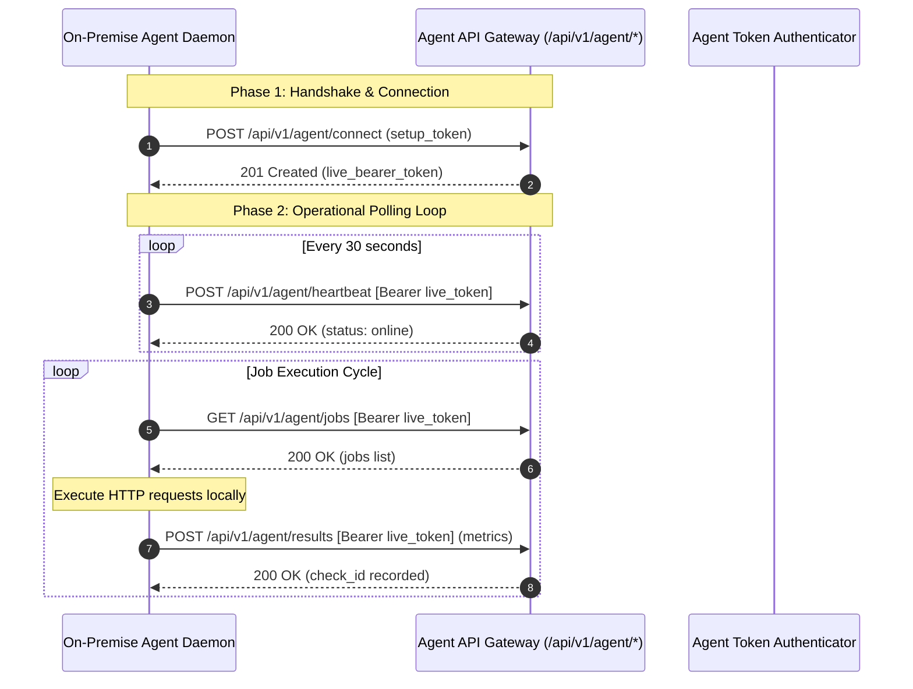

# API Architecture & Integration Protocols

This document details the API architecture, communication protocols, authentication models, and external integration payloads implemented in **ApiMonitor**.

> **Sanitization Notice**: All endpoint addresses, API tokens, webhook URLs, and payloads in this document are sanitized architectural examples. No production secrets, internal hostnames, or confidential client endpoints are disclosed.

---

## 1. Overview of API Surface

The platform exposes three primary integration layers:
1. **Private Agent Ingress Protocol (`/api/v1/agent/*`)**: REST API utilized by on-premise monitoring daemons to establish connections, transmit heartbeats, retrieve due check jobs, and report metrics.
2. **Internal Application Protocol (Inertia.js over HTTP)**: Stateful JSON-over-HTTP transport connecting the Vue 3 frontend with the Laravel backend.
3. **Outbound Third-Party Integrations**: Secure outbound REST clients communicating with **Google Gemini 1.5 Flash**, **Slack**, **Discord**, and **Custom Webhook Receivers**.

---

## 2. Private Agent Ingress Protocol (`/api/v1/agent/*`)

The Agent API facilitates secure communication between the central platform and distributed on-premise agents deployed behind corporate firewalls.



### Agent Endpoints Specification

#### 1. `POST /api/v1/agent/connect`
- **Purpose**: Exchanges a single-use setup token generated in the UI for a permanent, hashed agent bearer token.
- **Rate Limit**: Strict throttle (10 requests per minute per IP).
- **Request Payload**:
  ```json
  {
    "setup_token": "st_9f83b2a1c0e4d7f6e5a8b9c0d1e2f3a4",
    "agent_name": "vpc-us-east-1-prober",
    "version": "1.2.0"
  }
  ```
- **Response Payload (201 Created)**:
  ```json
  {
    "success": true,
    "message": "Agent connected successfully.",
    "agent_id": 14,
    "project_id": 3,
    "token": "ag_7a1b2c3d4e5f6g7h8i9j0k1l2m3n4o5p"
  }
  ```

#### 2. `POST /api/v1/agent/heartbeat`
- **Purpose**: Periodically transmitted by the agent every 30 seconds to maintain online liveness.
- **Authentication**: `Authorization: Bearer <live_token>`
- **Response Payload (200 OK)**:
  ```json
  {
    "success": true,
    "status": "online",
    "timestamp": "2026-09-30T10:00:00Z"
  }
  ```

#### 3. `GET /api/v1/agent/jobs`
- **Purpose**: Retrieves due synthetic checks assigned to this agent's project for execution inside the private network.
- **Authentication**: `Authorization: Bearer <live_token>`
- **Response Payload (200 OK)**:
  ```json
  {
    "jobs": [
      {
        "job_id": "job_102_1727690400_abc123",
        "monitor_id": 102,
        "name": "Internal Auth Microservice",
        "endpoint": "http://auth-service.internal.local/healthz",
        "method": "GET",
        "timeout": 5,
        "expected_status": 200,
        "warning_latency_ms": 300,
        "critical_latency_ms": 800,
        "headers": {
          "Accept": "application/json"
        },
        "query_params": {},
        "body": null,
        "mutation_mode": "read_only_health_check",
        "expectations": [
          {
            "type": "json_path",
            "path": "status",
            "operator": "equals",
            "value": "UP"
          }
        ]
      }
    ]
  }
  ```

#### 4. `POST /api/v1/agent/results`
- **Purpose**: Submits execution metrics and telemetry back to the central platform.
- **Authentication**: `Authorization: Bearer <live_token>`
- **Deduplication**: Results are cached with a unique `job_id` lock to prevent duplicate ingestion under network retries.
- **Request Payload**:
  ```json
  {
    "job_id": "job_102_1727690400_abc123",
    "monitor_id": 102,
    "status_code": 200,
    "response_time_ms": 48,
    "response_size_bytes": 1024,
    "health_status": "healthy",
    "is_success": true,
    "error_type": null,
    "error_message": null,
    "checked_at": "2026-09-30T10:00:05Z",
    "response_headers": {
      "content-type": "application/json",
      "x-ratelimit-limit": "1000",
      "x-ratelimit-remaining": "995"
    }
  }
  ```

#### 5. `POST /api/v1/agent/disconnect`
- **Purpose**: Clean agent deregistration and immediate token revocation.

---

## 3. Third-Party AI Integration: Google Gemini 1.5 Flash

When an incident triggers or an engineer clicks **AI Detective**, the system formats recent telemetry into a structured JSON prompt dispatched to:

```text
POST https://generativelanguage.googleapis.com/v1beta/models/gemini-1.5-flash:generateContent?key={GEMINI_API_KEY}
```

### Outbound AI Request Schema
```json
{
  "contents": [
    {
      "parts": [
        {
          "text": "Analyze the following failing API monitor and incident context, and identify the root cause, impact, and engineering resolution steps..."
        }
      ]
    }
  ],
  "generationConfig": {
    "temperature": 0.2,
    "responseMimeType": "application/json"
  }
}
```

### Structured Diagnostic Output
```json
{
  "problem": "GET /api/v1/orders is failing with HTTP 504 Gateway Timeout.",
  "when_started": "Started 12 minutes ago (10:18 AM)",
  "previous_behavior": "Historical uptime was 99.98% with average response time of 120ms.",
  "what_changed": "Response times escalated from 130ms to >10,000ms before returning 504 gateway timeouts.",
  "possible_causes": [
    { "cause": "Upstream database connection pool exhaustion", "confidence_percentage": 85 },
    { "cause": "Downstream payment gateway latency cascade", "confidence_percentage": 60 }
  ],
  "impact": "End-users cannot load order history; checkout completion requests may be stalled.",
  "suggested_checks": [
    "Check RDS/Postgres active connection pool saturation",
    "Inspect application log traces for unindexed slow queries on orders table",
    "Verify health of reverse-proxy load balancer"
  ],
  "recommended_action": "Restart order-service worker pods and verify DB connection count."
}
```

---

## 4. Multi-Channel Alert Payloads

### Slack Incoming Webhook Format
Dispatched via Slack Block Kit attachments with dynamic severity color bands:

```json
{
  "text": "🔴 API Down: Core Billing API",
  "attachments": [
    {
      "color": "#e11d48",
      "blocks": [
        {
          "type": "header",
          "text": { "type": "plain_text", "text": "🔴 API Down: Core Billing API", "emoji": true }
        },
        {
          "type": "section",
          "fields": [
            { "type": "mrkdwn", "text": "*Project:*\nE-Commerce Platform" },
            { "type": "mrkdwn", "text": "*Endpoint:*\n`POST https://api.example.com/checkout`" },
            { "type": "mrkdwn", "text": "*Status:* Down (3 consecutive failures)" },
            { "type": "mrkdwn", "text": "*Likely Cause:*\nHTTP 500 Internal Server Error" }
          ]
        }
      ]
    }
  ]
}
```

### Discord Webhook Format
Dispatched via Discord Rich Embed cards:

```json
{
  "username": "ApiMonitor Guard",
  "embeds": [
    {
      "title": "🟢 API Recovered: Core Billing API",
      "color": 1096065,
      "fields": [
        { "name": "Project", "value": "E-Commerce Platform", "inline": true },
        { "name": "Endpoint", "value": "`POST https://api.example.com/checkout`", "inline": true },
        { "name": "Status", "value": "Recovered (Downtime: 4m)", "inline": true },
        { "name": "Root Cause", "value": "Service restored to normal operation", "inline": false }
      ],
      "timestamp": "2026-09-30T10:30:00Z"
    }
  ]
}
```

### Custom Webhook JSON Payload
Standardized JSON schema emitted for third-party incident management systems:

```json
{
  "event": "api.down",
  "project": {
    "id": 12,
    "name": "E-Commerce Platform",
    "domain": "api.example.com"
  },
  "monitor": {
    "id": 102,
    "name": "Core Billing API",
    "endpoint": "https://api.example.com/checkout",
    "method": "POST"
  },
  "incident": {
    "id": 45,
    "started_at": "2026-09-30T10:20:00Z",
    "failure_count": 3,
    "likely_cause": "HTTP 500 Internal Server Error"
  },
  "timestamp": "2026-09-30T10:23:00Z"
}
```

---

## 5. Security & Rate Limiting Boundaries

- **Throttling Policies**:
  - `POST /api/v1/agent/connect`: Throttled to 10 requests / min.
  - Authenticated agent endpoints: Throttled to 120 requests / min per agent.
- **SSRF Validation**: All URLs are validated prior to connection; RFC 1918 subnets, loopbacks, and cloud metadata targets are rejected with HTTP 400.
- **Secret Redaction**: Any authorization headers or credentials in payloads are redacted using `SecretSanitizer` before persisting to database logs.
