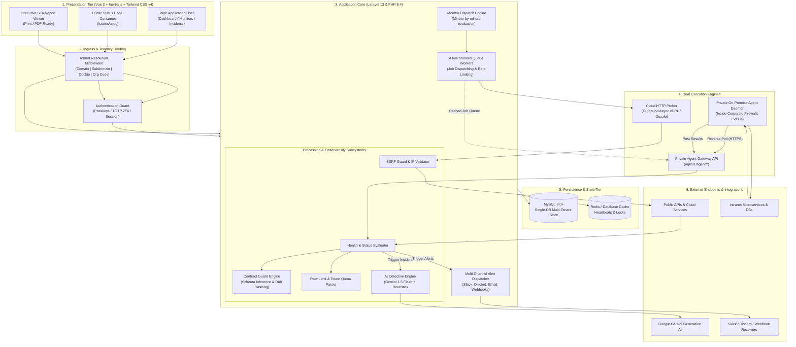
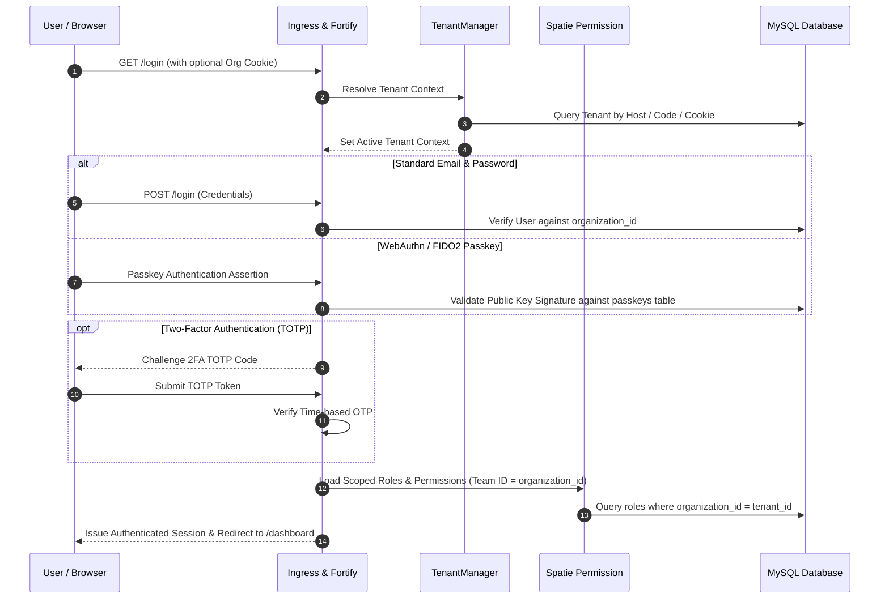
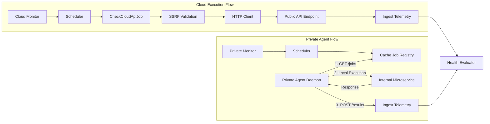

# System Architecture

## 1. Architectural Philosophy

**ApiMonitor** is designed as a distributed, high-throughput, multi-tenant API observability and automated Site Reliability Engineering (SRE) platform. It provides real-time telemetry, automated contract validation, rate-limit tracking, and AI-driven incident diagnosis without introducing operational complexity.

The architecture emphasizes:
- **Clean Separation of Concerns**: Strict decoupling of presentation, tenancy resolution, job scheduling, asynchronous probing, intelligence evaluation, and alert dispatch.
- **Fail-Safe Observability**: A dual-engine monitoring strategy ensuring both public endpoints and firewall-protected private VPCs can be continuously monitored.
- **Defensive Networking**: Multi-layer Server-Side Request Forgery (SSRF) protection preventing synthetic probers from attacking internal networks or cloud metadata APIs.
- **Single-Database Tenant Isolation**: Complete tenant segregation at the ORM layer while maintaining high connection-pool efficiency and simple database maintenance.

---

## 2. High-Level Architecture Diagram

---

## 3. Major Application Layers

### Layer 1: Presentation Tier (Single-Page Experience)
- **Framework**: Vue 3 with the Composition API (`<script setup>`) and TypeScript.
- **Inertia.js Protocol**: Connects server-side Laravel routing directly with Vue components, eliminating the overhead of maintaining an intermediary REST API layer for the UI while retaining full client-side SPA interactivity.
- **Component Primitives**: Built on shadcn-vue and Reka UI primitives styled using Tailwind CSS v4, supporting accessible keyboard navigation, dark mode, and responsive layouts.

### Layer 2: Ingress & Tenancy Routing
- **Multi-Strategy Tenant Identification**:
  1. *Host / Subdomain Match*: Resolves `acme.apimonitor.com` to tenant `acme`.
  2. *Active Session State*: Retrieves the tenant ID from the authenticated user's session.
  3. *Remembered Cookie*: Fallback to encrypted `last_organization` cookie.
  4. *Pre-Login Organization Selection*: Users enter an organization code at `/organization` before logging in.
  5. *Central Landlord Fallback*: Requests to central domains (`localhost`, `apimonitor.net`) route to the default organization or the central management console.
- **Context Injection**: `TenantManager` sets the active tenant singleton for the request lifecycle, ensuring all Eloquent queries automatically inherit tenant scoping.

### Layer 3: Application Core & Dispatch Engine
- **Minute-by-Minute Dispatching**: The Artisan command `monitor:dispatch-due` runs via the system scheduler. It queries active monitors across all tenants where `next_check_at <= now()` and dispatches asynchronous execution jobs.
- **SSRF Validation**: Before any outbound HTTP request leaves the server, target URLs pass through strict IP validation against loopback, private subnets, and cloud metadata addresses.

### Layer 4: Dual Execution Engines
- **Cloud HTTP Prober**: Executes outbound checks for publicly accessible endpoints. Uses configurable HTTP verbs (`GET`, `POST`, `PUT`, `PATCH`, `DELETE`, `HEAD`), request timeouts (1–60s), custom headers, and query parameters.
- **Private On-Premise Agent Gateway**: An unauthenticated script download endpoint allows engineers to deploy `api-monitor-agent.php` on internal servers. The agent connects to `/api/v1/agent/*` using a SHA-256 setup token handshake, continuously heartbeats every 30 seconds, pulls due checks targeting private VPCs, and submits telemetry back over outbound HTTPS.

### Layer 5: Observability & Intelligence Pipeline
- **Health Evaluator**: Compares actual HTTP status codes against expected codes, measures round-trip latency, and categorizes status into `Healthy`, `Degraded`, or `Down`.
- **Contract Guard**: Validates JSON payloads against inferred schemas, checking field existence, strict data types, nullability, structural MD5 hashes, and body size swings ($\ge 65\%$).
- **Rate Limit Parser**: Extracts provider-specific rate-limit and token quota headers (OpenAI, Anthropic, standard RFC) and computes capacity consumption percentages.
- **AI Detective (Gemini 1.5 Flash)**: On incident creation, assembles recent telemetry context, latency jumps, and failure traces into a structured prompt sent to Google Gemini 1.5 Flash. If unavailable, an internal heuristic engine provides deterministic diagnosis.

### Layer 6: Persistence & Caching Tier
- **MySQL 8.0+**: Houses single-database multi-tenant tables. Core tables feature `organization_id` foreign keys, composite indexes on `(organization_id, checked_at)`, and cascading deletions.
- **Cache Engine**: Manages private agent heartbeats, short-lived deduplication locks for ingested checks, and rate-limiting counters.

---

## 4. Authentication & Authorization Flow

### Authorization Architecture:
- Scoped to the active organization using Spatie Laravel Permission's **Teams Feature** (`setPermissionsTeamId($tenantId)`).
- Permissions follow standard dotted conventions: `monitors.view`, `monitors.create`, `monitors.edit`, `monitors.delete`, `projects.ssl`, `agents.revoke`, `activity-logs.view`.
- Super Admins operating under the default organization code (`DEFAULT`) gain access to central landlord features (`/central/tenants`) to provision organizations and set credit limits.

---

## 5. Dual Monitoring Engine Flow

---

## 6. External Integrations Architecture

| Integration | Transport | Authentication | Security Controls |
| :--- | :--- | :--- | :--- |
| **Monitored APIs** | HTTP/1.1 & HTTP/2 | Bearer, Basic, API Key, Custom Headers | SSRF Shield, Secret Sanitizer, Redirect Block |
| **Private Agents** | HTTPS REST | SHA-256 Hashed Setup Tokens & Live Bearer Tokens | Throttle (120 req/min), Cache Lock, Heartbeat TTL |
| **Google Gemini Flash** | HTTPS REST | Query Parameter API Key (`generativelanguage.googleapis.com`) | Sanitize payloads, Heuristic fallback on failure |
| **Slack Webhooks** | HTTPS POST | Webhook Token URL | Redact internal tokens, rate-limited dispatch |
| **Discord Webhooks** | HTTPS POST | Webhook Token URL | Rich embeds with severity colors |
| **Custom Webhooks** | HTTPS POST | Optional Custom Headers / Secret Headers | Standard JSON payload format |
| **Mail (SMTP/SES)** | TLS / Port 587 | SMTP Credentials | Transactional templates, recipient deduplication |
