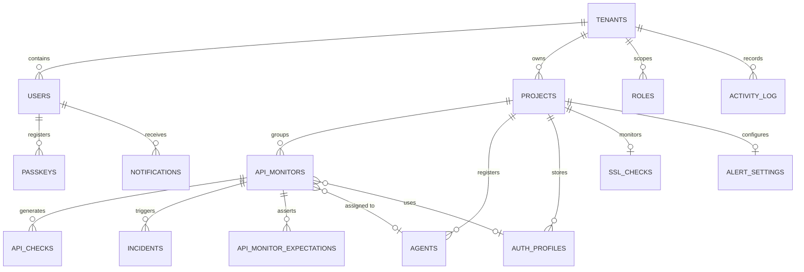
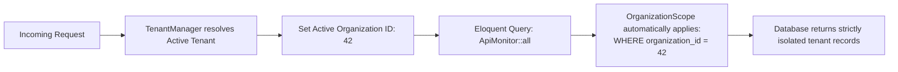

# Database Schema & Data Architecture

This document outlines the data model, entity relationships, indexing strategies, and retention policies of **ApiMonitor**.

> **Sanitization Notice**: All schema definitions, table names, and field specifications in this document are generic architectural representations. Sensitive credentials, production connection strings, encryption salts, and real customer data have been strictly excluded.

---

## 1. Entity-Relationship Overview

ApiMonitor uses a **Single-Database Multi-Tenant Architecture**. Every tenant-owned table contains an `organization_id` foreign key referencing the `tenants` table, enforced through global query scoping (`BelongsToOrganization`).

---

## 2. Core Entity Catalog

### 1. `tenants` (Organizations)
Represents independent organizational workspaces.
- **Key Attributes**: `id`, `name`, `code` (unique uppercase identifier), `slug`, `domain` (custom domain mapping), `is_active`, `credit_limit`, `credits_used`, `created_at`.
- **Relationships**: Parent entity for `users`, `projects`, `roles`, and `activity_log`.

### 2. `users`
Authenticated engineers, administrators, and stakeholders.
- **Key Attributes**: `id`, `organization_id`, `name`, `email`, `email_verified_at`, `two_factor_confirmed_at`, `credits_used`, `timestamps`.
- **Relationships**: Belongs to `tenants`. Has many `passkeys` and `notifications`. Scoped to tenant roles via `model_has_roles`.

### 3. `projects`
Application boundaries grouping monitors, agents, and alert rules.
- **Key Attributes**: `id`, `organization_id`, `user_id`, `name`, `slug` (for public status page URL routing), `domain`, `environment` (`production`, `staging`, `testing`), `is_active`, `is_public_status_page`, `status_page_title`, `timestamps`, `soft_deletes`.
- **Relationships**: Belongs to `tenants`. Has many `api_monitors`, `agents`, `auth_profiles`. Has one `ssl_checks` and `alert_settings`.

### 4. `api_monitors`
Configuration and state for individual synthetic checks.
- **Key Attributes**:
  - *Target*: `id`, `organization_id`, `project_id`, `agent_id` (nullable), `auth_profile_id` (nullable), `name`, `endpoint`, `method` (`GET`, `POST`, etc.), `monitoring_type` (`cloud` vs `private_agent`).
  - *Execution*: `check_interval_seconds`, `timeout_seconds`, `expected_status_code`, `warning_latency_ms`, `critical_latency_ms`, `mutation_mode`.
  - *Payload*: `headers` (JSON), `query_params` (JSON), `body`, `body_type` (`raw_json`, `form_data`, `x_www_form_urlencoded`).
  - *Real-Time State*: `is_active`, `current_status` (`healthy`, `degraded`, `down`, `unknown`), `current_latency_ms`, `uptime_percentage`, `consecutive_failures`, `consecutive_successes`, `last_checked_at`, `next_check_at`.
  - *Contract & Quota*: `schema_contract` (JSON), `last_schema_hash`, `last_response_size`, `baseline_p95_latency`, `rate_limit_limit`, `rate_limit_remaining`, `rate_limit_tokens_limit`, `rate_limit_tokens_remaining`, `rate_limit_reset_at`, `rate_limit_provider`.
- **Relationships**: Belongs to `projects`, optionally belongs to `agents` and `auth_profiles`. Has many `api_checks`, `incidents`, `api_monitor_expectations`.

### 5. `api_checks` (Telemetry Logs)
High-frequency execution log records for every health check performed.
- **Key Attributes**: `id`, `organization_id`, `api_monitor_id`, `agent_id` (nullable), `status_code`, `response_time_ms`, `response_size_bytes`, `health_status` (`healthy`, `degraded`, `down`), `is_success`, `error_type`, `error_message`, `rate_limit_limit`, `rate_limit_remaining`, `rate_limit_tokens_limit`, `rate_limit_tokens_remaining`, `checked_at`.
- **Relationships**: Belongs to `api_monitors`. Indexed heavily for time-series aggregation.

### 6. `incidents`
Tracks outages and performance degradation events.
- **Key Attributes**: `id`, `organization_id`, `api_monitor_id`, `status` (`open`, `resolved`), `started_at`, `resolved_at`, `duration_minutes`, `failure_count`, `recovery_count`, `initial_error`, `last_error`, `ai_analysis` (structured JSON from Gemini), `likely_cause`, `impact_summary`.
- **Relationships**: Belongs to `api_monitors`.

### 7. `agents` (Private VPC Daemons)
Connected on-premise monitoring agent instances.
- **Key Attributes**: `id`, `organization_id`, `project_id`, `name`, `token_hash` (SHA-256), `status` (`online`, `offline`, `revoked`), `version`, `last_seen_at`, `connected_at`, `revoked_at`, `is_active`.
- **Relationships**: Belongs to `projects`. Has many `api_monitors` and `api_checks`.

### 8. `auth_profiles`
Reusable credentials for monitored endpoints.
- **Key Attributes**: `id`, `organization_id`, `project_id`, `name`, `auth_type` (`none`, `bearer`, `basic`, `api_key`, `custom_headers`), `token_reference`, `username_reference`, `password_reference`, `api_key_name`, `api_key_location`, `config` (JSON).
- **Relationships**: Belongs to `projects`. Associated with `api_monitors`.

### 9. `ssl_checks`
TLS/SSL certificate monitoring state.
- **Key Attributes**: `id`, `organization_id`, `project_id`, `is_valid`, `issuer`, `valid_from`, `expires_at`, `days_remaining`, `error_message`, `last_checked_at`, `last_alerted_threshold`.
- **Relationships**: Belongs to `projects`.

### 10. `alert_settings`
Notification channel configuration per project.
- **Key Attributes**: `id`, `organization_id`, `project_id`, `email_recipients` (JSON), `slack_webhook_url`, `discord_webhook_url`, `custom_webhook_url`, `notify_on_down`, `notify_on_recovered`, `notify_on_latency`, `notify_on_regression`, `notify_on_contract_change`, `notify_on_agent_offline`, `notify_on_ssl_expiry`, `notify_on_low_credits`.
- **Relationships**: Belongs to `projects`.

---

## 3. Indexing & Query Optimization Strategy

To maintain sub-50ms query response times under high-frequency check ingestion, the database applies composite and selective indexes:

| Table | Composite Index | Query Target / Optimization |
| :--- | :--- | :--- |
| `api_checks` | `(api_monitor_id, checked_at)` | Timeframe metric rollups and percentile latency computations. |
| `api_checks` | `(organization_id, checked_at)` | Tenant-level availability dashboard aggregation. |
| `api_checks` | `(health_status)` | Quick filtering of degraded/failing checks. |
| `api_monitors` | `(organization_id, monitoring_type, is_active, next_check_at)` | Scheduler worker polling for due checks every minute. |
| `incidents` | `(api_monitor_id, status)` | Fast lookup of active open incidents during check processing. |
| `incidents` | `(organization_id, status)` | Dashboard active outage counters and incident tables. |
| `agents` | `(organization_id, status)` | Heartbeat tracking and offline agent detection sweeps. |
| `users` | `(organization_id, email)` | Authentication lookups within specific tenant scopes. |

---

## 4. Multi-Tenant Scoping Architecture

Multi-tenancy is enforced through a global Eloquent scope (`OrganizationScope`):

- When creating records, `BelongsToOrganization` automatically assigns `organization_id = TenantManager::getTenant()->id`.
- Queries executing in background CLI jobs or public pages use `TenantManager::runForTenant($tenant, $callback)` or explicitly bypass scopes using `withoutGlobalScopes()` only when cross-tenant aggregation is intended (e.g., central cron dispatchers).

---

## 5. Retention & Archival Strategy

High-frequency synthetic monitoring generates substantial time-series data. To prevent database index bloat and keep disk usage predictable:

- **Automated 60-Day Purging**: A daily cron job (`CleanupOldApiChecksJob`) deletes raw `api_checks` records older than 60 days across all active tenants.
- **Permanent Incident & Monitor Baselines**: Aggregated statistics (`uptime_percentage`, `baseline_p95_latency`) and historical `incidents` are persisted indefinitely for long-term SLA reporting.
