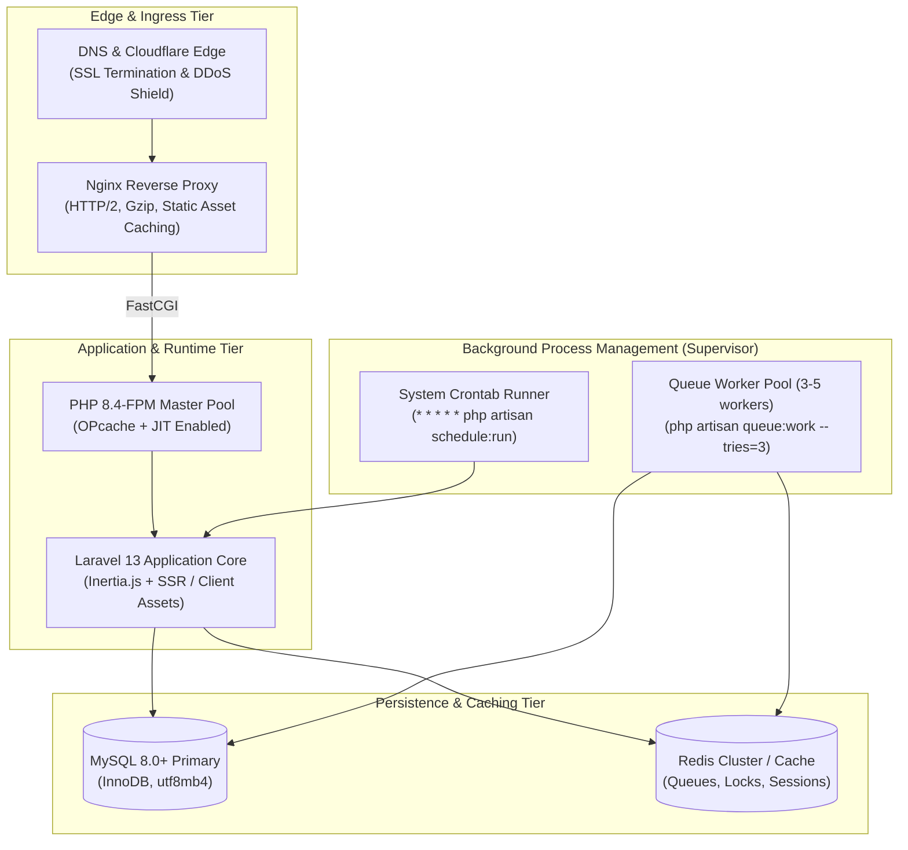
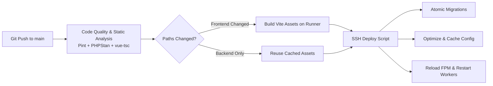

# Deployment & Infrastructure Overview

This document describes the production hosting architecture, runtime configuration, process management, and automated continuous delivery (CI/CD) pipelines for **ApiMonitor**.

> **Sanitization Notice**: All server hostnames, IP addresses, credentials, and SSH keys in this document are generic examples. No proprietary infrastructure details or private credentials are disclosed.

---

## 1. Production Architecture Overview

ApiMonitor is designed for deployment across modern cloud virtual machines (AWS EC2, DigitalOcean, Hetzner) or managed PaaS environments supporting persistent background processes.



---

## 2. Server & Runtime Prerequisites

| Component | Minimum Specification | Recommended Production Spec |
| :--- | :--- | :--- |
| **Compute** | 2 vCPU, 2 GB RAM | 4+ vCPU, 8 GB RAM |
| **Operating System** | Ubuntu 22.04 LTS / Debian 12 | Ubuntu 24.04 LTS |
| **PHP Runtime** | PHP 8.4 CLI & FPM | PHP 8.4+ with JIT |
| **Required PHP Extensions** | `bcmath`, `curl`, `json`, `mbstring`, `openssl`, `pdo_mysql`, `tokenizer`, `xml`, `zip` | Include `redis`, `opcache` |
| **Node.js** | Node.js 20.x LTS & npm | Node.js 22.x LTS |
| **Database** | MySQL 8.0+ | MySQL 8.0+ or AWS Aurora MySQL |
| **Cache & Queue** | Database Driver / Redis 7.x | Dedicated Redis 7.x instance |

---

## 3. Web Server & FastCGI Configuration (Nginx)

The following sanitized Nginx server block provides HTTP/2 negotiation, static asset caching, and security header enforcement:

```nginx
server {
    listen 80;
    listen [::]:80;
    server_name apimonitor.example.com;
    return 301 https://$host$request_uri;
}

server {
    listen 443 ssl http2;
    listen [::]:443 ssl http2;
    server_name apimonitor.example.com;
    root /var/www/apimonitor/public;

    ssl_certificate /etc/ssl/certs/apimonitor.crt;
    ssl_certificate_key /etc/ssl/private/apimonitor.key;
    ssl_protocols TLSv1.2 TLSv1.3;
    ssl_ciphers HIGH:!aNULL:!MD5;

    # Security Headers
    add_header X-Frame-Options "SAMEORIGIN" always;
    add_header X-Content-Type-Options "nosniff" always;
    add_header X-XSS-Protection "1; mode=block" always;
    add_header Referrer-Policy "strict-origin-when-cross-origin" always;

    index index.php;
    charset utf-8;

    # Client side asset caching
    location ~* \.(css|js|jpg|jpeg|png|gif|ico|svg|woff|woff2|ttf|eot)$ {
        expires 1y;
        add_header Cache-Control "public, no-transform";
        access_log off;
    }

    location / {
        try_files $uri $uri/ /index.php?$query_string;
    }

    location = /favicon.ico { access_log off; log_not_found off; }
    location = /robots.txt  { access_log off; log_not_found off; }

    error_page 404 /index.php;

    location ~ \.php$ {
        fastcgi_pass unix:/var/run/php/php8.4-fpm.sock;
        fastcgi_param SCRIPT_FILENAME $realpath_root$fastcgi_script_name;
        include fastcgi_params;
        fastcgi_hide_header X-Powered-By;
    }

    location ~ /\.(?!well-known).* {
        deny all;
    }
}
```

---

## 4. Background Process & Queue Supervision

ApiMonitor relies on background queue workers to handle synthetic probing, AI investigations, and notifications asynchronously. Supervisor ensures these processes run continuously and restart automatically upon crashes.

### Supervisor Configuration (`/etc/supervisor/conf.d/apimonitor-worker.conf`)
```ini
[program:apimonitor-worker]
process_name=%(program_name)s_%(process_num)02d
command=php /var/www/apimonitor/artisan queue:work --sleep=3 --tries=3 --max-time=3600 --timeout=90
autostart=true
autorestart=true
stopasgroup=true
killasgroup=true
user=www-data
numprocs=4
redirect_stderr=true
stdout_logfile=/var/log/supervisor/apimonitor-worker.log
stopwaitsecs=3600
```

### System Scheduler (Crontab)
To execute monitor dispatches and SSL audits on time, the standard Laravel cron entry is installed:

```bash
* * * * * cd /var/www/apimonitor && php artisan schedule:run >> /dev/null 2>&1
```

---

## 5. Automated CI/CD Pipeline (GitHub Actions)

ApiMonitor features a continuous delivery pipeline (`.github/workflows/deploy.yml`) delivering zero-downtime atomic deployments:



### Pipeline Workflow Steps
1. **Static Analysis & Linting**:
   - Executes **Laravel Pint** to verify PHP code style compliance.
   - Runs **PHPStan** for static analysis and type safety verification.
   - Validates Vue 3 views and TypeScript definitions via `vue-tsc --noEmit`.
2. **Selective Asset Compilation**:
   - Uses `dorny/paths-filter` to detect if frontend resources (`resources/`, `package.json`, `vite.config.ts`) changed.
   - If changed, compiles production assets on the GitHub runner (Node.js 20) and transfers only compiled bundles to the server.
3. **Atomic Deployment Flow**:
   ```bash
   # 1. Enter maintenance mode
   php artisan down --render="errors::503" --secret="deployment-bypass"

   # 2. Pull latest code & install production PHP dependencies
   git pull origin main
   composer install --no-dev --optimize-autoloader --no-interaction

   # 3. Run atomic database migrations
   php artisan migrate --force

   # 4. Cache application configurations, routes, and views
   php artisan config:cache
   php artisan route:cache
   php artisan view:cache

   # 5. Restart background queue workers
   php artisan queue:restart

   # 6. Exit maintenance mode
   php artisan up
   ```

---

## 6. Environment Configuration Best Practices

Production `.env` templates should strictly adhere to security standards:

```ini
APP_NAME="ApiMonitor"
APP_ENV=production
APP_KEY=base64:... # Cryptographically secure key
APP_DEBUG=false
APP_URL=https://apimonitor.example.com

# Multi-Tenant Central Domain Configuration
CENTRAL_DOMAINS="apimonitor.example.com"
DEFAULT_ORG_CODE="DEFAULT"

# Database Configuration (MySQL 8.0+)
DB_CONNECTION=mysql
DB_HOST=127.0.0.1
DB_PORT=3306
DB_DATABASE=apimonitor_prod
DB_USERNAME=apimonitor_user
DB_PASSWORD=****************

# High-Performance Session & Queue Storage
SESSION_DRIVER=database
QUEUE_CONNECTION=database
CACHE_STORE=database

# Google Gemini Flash API Key (for AI Detective)
GEMINI_API_KEY=****************
GEMINI_MODEL=gemini-1.5-flash

# Monitoring Defaults
MONITOR_ALERT_ROLES="Super Admin,Admin"
MONITOR_FAILURES_BEFORE_ALERT=1
MONITOR_SUCCESSES_BEFORE_RECOVERY=1
```
