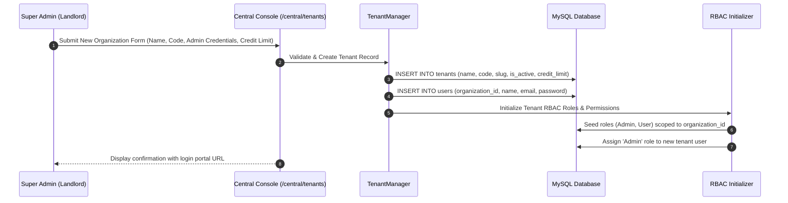
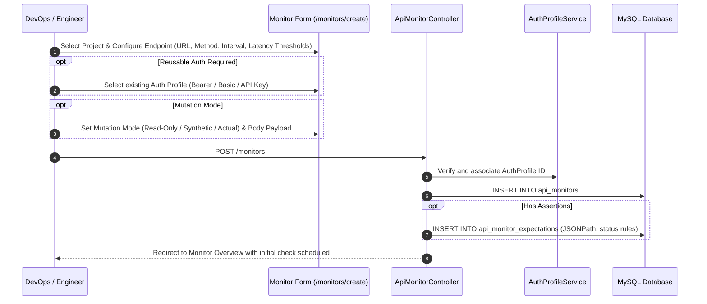
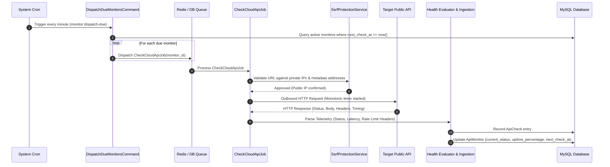
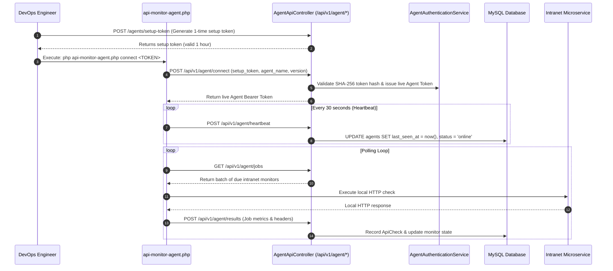
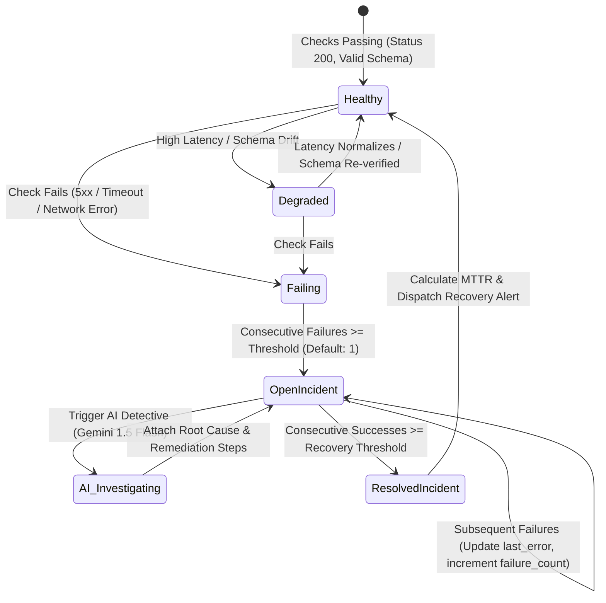
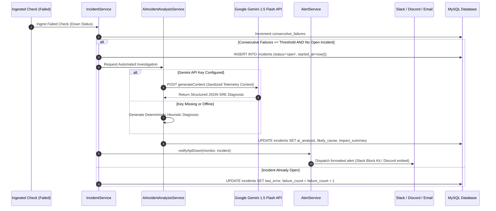
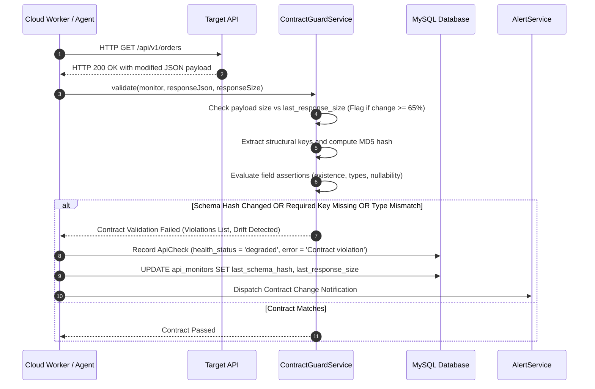
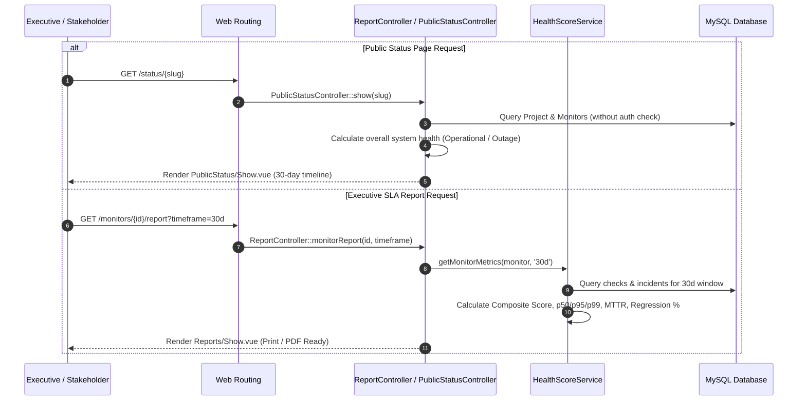

# End-to-End System Workflows

This document details the primary operational and data workflows within the **ApiMonitor** platform, illustrated with step-by-step descriptions and Mermaid sequence and state diagrams.

---

## 1. Workflow 1: Tenant Provisioning & Workspace Setup

This workflow describes how the platform initializes a new organization workspace, assigns administrative permissions, and establishes tenant boundaries.

### Steps:
1. **Landlord Submission**: Super-admin opens `/central/tenants` and submits organization parameters (organization name, unique uppercase code, initial admin email, password, and monthly check credit balance).
2. **Entity Generation**: Platform persists the tenant record, generating unique slugs and codes.
3. **Admin User Creation**: Creates the organization's primary administrator account associated with the new `organization_id`.
4. **RBAC Seeding**: Seeds tenant-scoped roles (`Admin`, `User`) and associates initial permissions using Spatie's team-scoping architecture.
5. **Credit Allocation**: Initializes the check credit budget, allowing the tenant to begin creating projects and monitors.

---

## 2. Workflow 2: Endpoint Registration & Synthetic Configuration

This workflow illustrates how an engineer registers a new API monitor, configures authentication profiles, and sets validation expectations.

### Steps:
1. **Endpoint Specification**: Engineer specifies the target API URL, HTTP method, check interval (1m–60m), and timeout threshold.
2. **Latency Expectations**: Configures warning latency (e.g., 500ms) and critical latency (e.g., 1000ms) boundaries.
3. **Authentication Binding**: Attaches an existing `AuthProfile` (or creates a new profile referencing environment secrets).
4. **Payload Setup**: Sets the mutation safety mode and defines request headers, query parameters, or request bodies (`raw_json`, `form_data`, `x_www_form_urlencoded`).
5. **Schedule Initialization**: Calculates `next_check_at = now()`, immediately queueing the monitor for initial execution.

---

## 3. Workflow 3: Automated Cloud Polling & Ingestion Cycle

This workflow details the automated minute-by-minute execution of public API health checks.

### Steps:
1. **Cron Trigger**: The system scheduler executes `php artisan monitor:dispatch-due` every minute without overlapping.
2. **Due Monitor Query**: Evaluates active monitors across all tenants whose `next_check_at` timestamp has elapsed.
3. **Asynchronous Dispatch**: Pushes individual `CheckCloudApiJob` instances to the queue worker pool.
4. **SSRF Screening**: `SsrfProtectionService` performs DNS resolution and verifies that resolved IP addresses do not map to loopback (`127.0.0.1`), RFC 1918 subnets, or cloud metadata endpoints (`169.254.169.254`).
5. **HTTP Execution**: Issues the outbound request, tracking latency with microsecond accuracy via `hrtime`.
6. **Telemetry Parsing**: Parses HTTP status code, response time, payload size, and rate-limit headers.
7. **Persistence**: Saves an immutable `ApiCheck` record and updates monitor aggregates (uptime percentage, current latency, next check timestamp).

---

## 4. Workflow 4: Private On-Premise Agent Registration & Execution

This workflow shows how private VPC agents register, maintain heartbeats, pull intranet jobs, and return metrics.

### Steps:
1. **Token Generation**: In the web UI, an administrator generates a setup token for a specific project.
2. **Agent Connect Handshake**: The standalone agent script runs `php api-monitor-agent.php connect <TOKEN>`. The gateway verifies the SHA-256 token hash, invalidates the setup token, and returns a permanent, hashed live agent bearer token.
3. **Heartbeat Maintenance**: The agent transmits periodic heartbeats every 30 seconds. A scheduled task flags agents offline if no heartbeat is received for 120 seconds.
4. **Reverse Job Polling**: The agent queries `/api/v1/agent/jobs` to retrieve due checks assigned to its project.
5. **Local Execution**: The agent executes HTTP checks inside the private network (intranet APIs, VPC databases).
6. **Result Ingestion**: Results (status, response time, headers, error traces) are submitted via `/api/v1/agent/results` with cache-based deduplication.

---

## 5. Workflow 5: Incident Lifecycle & AI Root-Cause Investigation

This state diagram and sequence illustrate how incidents open, trigger AI investigations, notify stakeholders, and resolve.

### Incident State Machine

### Detailed Sequence Diagram

---

## 6. Workflow 6: Contract Guard Drift Detection & Alerting

This workflow shows how silent JSON schema breakages are detected and alerted without needing HTTP 5xx errors.

---

## 7. Workflow 7: Executive SLA Report Generation & Status Page Publishing

This workflow illustrates how operational telemetry is aggregated into customer-facing dashboards and executive reports.

